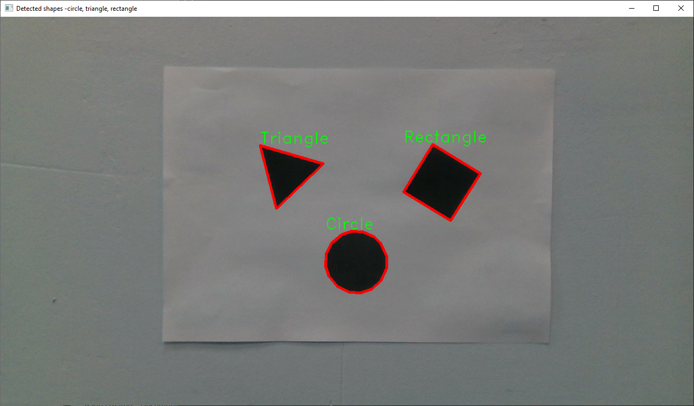

# OpenCV detect shapes example app

Made with python3, OpenCV, and numpy

## Usage

You need camera intrinsics parameters in json file.
The source of json file should contain something like that:
`{"ffx": 915.008056640625, "ffy": 913.262451171875}`

Run:
`python detect-shapes.py <image-file> <camera-intrinsics-file> <object-distance-from-camera-mm> [--show]`

With `--show` option, app will show image with labels and contours of shapes.

